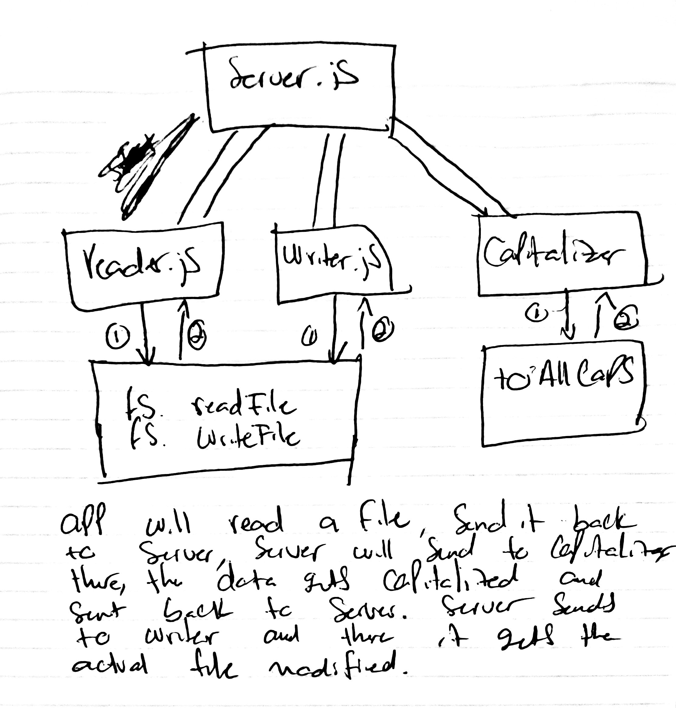

# lab-12

## Socket.io

### Author: Antonella Gutierrez

### Links and Resources
* [submission PR](https://github.com/antonella-401-advanced-javascript/lab-12/pull/1)
* [travis](https://travis-ci.com/antonella-401-advanced-javascript/lab-12/builds/131238678)

###  Socket
* `reader.js`
  * Accepts a filename as a command line parameter
  * Reads the file from the file system
* `capitalizer.js`
  * Converts it's contents to upper case
* `writer.js`
  * Writes it back to the file system
* `server.js`
  * broadcasts and listens to `reader.js`, `capitalizer.js`, and `writer.js`

### Setup
#### .env requirements
* PORT - 3000
#### Running the app
* npm start
* npm start:watch
#### Tests
* Unit Tests: npm test
* Lint Tests: npm run lint
#### UML
